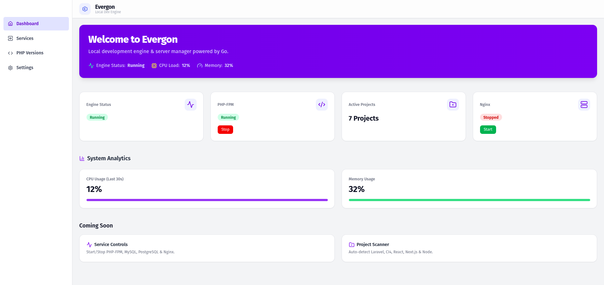
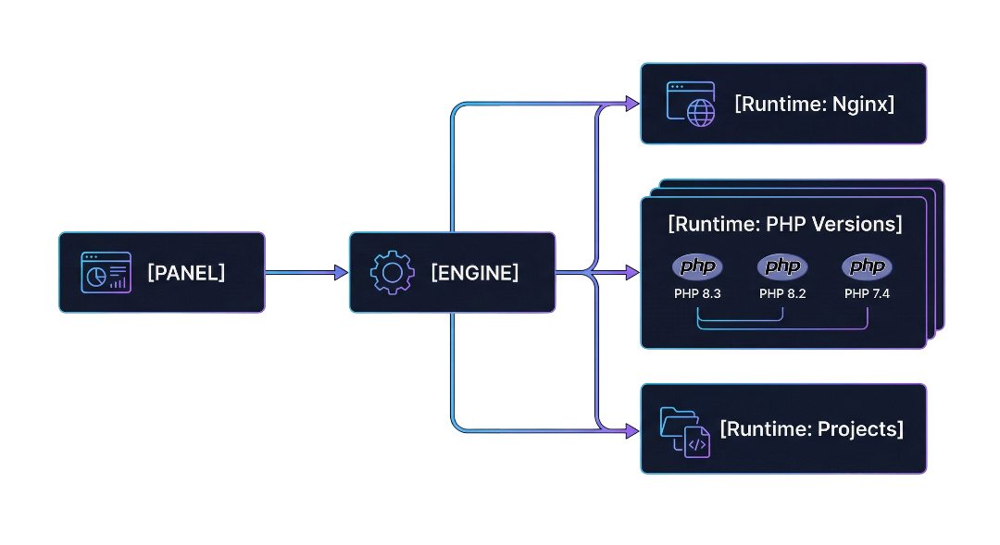

# Evergon — Modern Local Dev Environment (v0.1 Foundation Release)


Evergon is a **modular, portable, and developer-centric local web environment**, designed as a cleaner and more extensible alternative to tools like **Laragon**, **XAMPP**, and **MAMP** — but with a modern architecture built on **Go**, isolated runtimes, and service-level orchestration.

This first foundation release establishes the **core engine**, runtime scaffolding, and architectural direction.  
Future versions will introduce full UI control, runtime switching, portable services, and installer packaging.

---

## Preview (Dashboard Sneak Peek)

<p align="center">
  
</p>

The upcoming panel provides:

- service monitoring  
- PHP / Nginx controls  
- project detection  
- system analytics  
- runtime switching (planned)

---

## Why Evergon Exists

Traditional local dev stacks are:

✖ monolithic  
✖ hard to extend  
✖ Windows-dependent  
✖ locked to fixed runtimes  
✖ not developer-first  

Evergon is built to be:

✅ portable  
✅ modular  
✅ cross-platform  
✅ service-oriented  
✅ developer-controlled  

---

# Project Status — v0.1 FOUNDATION

### ✅ Implemented
- Core Go Engine
- Internal API surface
- Base Process Manager
- Early Nginx Manager
- Portable Nginx Runtime
- Config Loader
- Basic Project Scanner

### 🧩 In Development
- PHP runtime switching manager
- Control Panel (React + Tailwind)
- Auto virtual host generator
- Service lifecycle orchestration
- Engine ↔ Panel communication layer

### 🔜 Coming Soon
- MySQL portable runtime
- PHP-FPM orchestration
- SSL support
- Windows installer
- Add-on / plugin ecosystem

> **Evergon is not production-ready.**
> v0.1 is intended for architecture validation and experimentation.

---

# Architecture

<p align="center">
  
</p>

**Horizontal flow:**

**Panel → Engine → Runtimes (Nginx / PHP / Projects)**  
The Engine acts as the orchestration core.

---

## Project Structure

```
evergon/
  engine/
    cmd/evergon-engine/
    internal/{api,process,manager,scanner,config,util}
    go.mod

  panel/
  admin/
  php_versions/
  nginx/{build,portable}
  nginx_template/
  installer/
  docs/images/
  public/
  www/
```

---

# Getting Started (v0.1)

### 1. Clone
```bash
git clone https://github.com/azdharsyahputra/evergon.git
cd evergon
```

### 2. Build Engine
```bash
cd engine
go build -o evergon-engine ./cmd/evergon-engine
```

### 3. Run Engine
```bash
./evergon-engine
```

### 4. Panel (placeholder)
Scaffold exists — integration planned for v0.2+.

---

# Roadmap

## v0.2
- PHP Manager (runtime switching)
- Engine ↔ Panel communication
- Auto-vhost generation
- Service lifecycle control
- Basic install script

## v0.3
- PHP-FPM integration
- MySQL portable runtime
- SSL (self-signed)
- Project presets (Laravel / CI4)

## v0.4
- Windows Installer (.exe)
- Plugin system
- Optional Caddy engine

## v1.0 Stable
- Full control panel UI
- Complete runtime ecosystem
- Production-ready workflows

---

## Contributing
Public contribution opens at **v0.3**  
Feedback and discussion already welcome.

---

## Star & Watch
If you want to follow development progress:

⭐ **Star this repo**  
👁 **Watch → Releases Only**

---

## License
MIT License

---

## Author
**Muhammad Azdhar Syahputra**  
Creator & Lead Developer — Evergon
